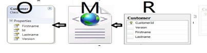
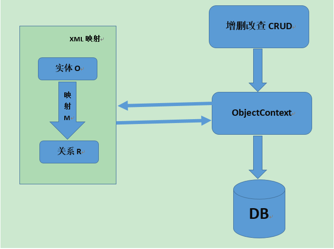

ORM思想解析
=====
### 一、ORM简介
#### 1.ORM定义
对象关系映射(Object Relational Mapping,简称ORM)，作用：用户实现面向对象编程语言里不同类型系统的数据之间的转换。  
从效果上说，它其实是创建了一个可在编程语言里使用的“虚拟对象数据库”。  
广义上：ORM指的是面向对象模型和关系型数据库的数据结构之间的相互转换。  
狭义上：基于关系型数据库的数据存储，实现一个虚拟的面向对象的数据访问接口。  
#### 2.ORM思想解析  
| O(对象模型) | 实体对象，在程序中根据数据库表结构建立的一个个实体Entity.  |
| :------ | ------ |  
| R(关系型数据库的数据结构) | 建立的数据库表 |  
| M(映射) | 从R(数据库)到O(对象模型)的映射，可通过XML文件映射 |   
当表实体发生变化时，ORM会帮助我们把实体的变化映射到数据库表。  
  
-------
 #### orm映射关系图解
  
主要目的：操作实体类就相当于操作数据库表  
建立两个映射关系：  
    实体类和表的映射关系  
    实体类中属性和表中字段的映射关系  
 
#### 3.ORM的优缺点 
**优点：**  
1.提高开发效率，降低开发成本  
2.室开发更加对象化  
3.可移植  
4.可以很方便地引入数据缓存之类的附加功能  
**缺点：**  
1.自动化进行关系数据库的映射需要消耗系统性能。  
2.在处理多表联查、where条件复杂之类的查询时，ORM的语法会变得复杂。  
#### 4.实现orm思想的框架：
mybatis,hibernate