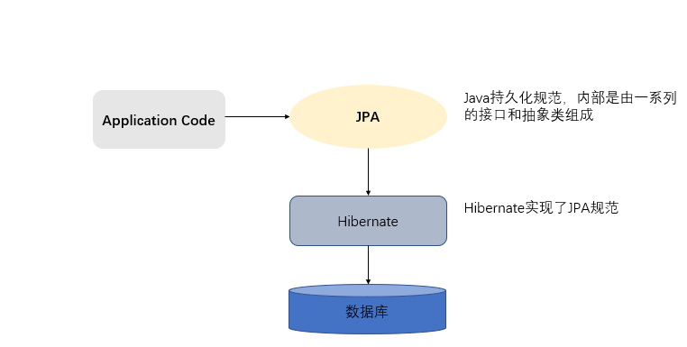

JPA简介
============
### 1.JPA概述
JPA的全称Java Persistence API,即Javc持久化API,是SUN公司推出的一套基于ORM的规范，内部是由一系列的接口和抽象类构成。  

JPA通过JDK5.0注解描述对象 - 关系表的映射关系，并将运行期的实体对象持久化到数据库中。  

### 2.JPA的优势
#### 2.1 标准化
  JPA是JCP组织发布的Java标准之一，因此任何声称符合JPA标准的框架都是遵循同样的架构，提供相同的访问API,这保证了基于JPA开发的企业应用能够经过少量的修改就能够在不同的JPA框架下运行。  
#### 2.2 容器级特性的支持
  JPA框架中支持大数据集、事物、并发等容器级事物，这使得JPA超越了简单持久化框架的局限，在企业应用发挥更大的作用。
#### 2.3 简单方便
  JPA的主要目标之一就是提供更加简单的编程模型，在JPA框架下创建实体和创建Java类一样简单，没有任何的约束和限制，只需要使用javax.persistence.Entity进行注解，JPA的框架和接口也都非常简单，没有太多特别的规则和设计模式的要求，开发者可以很容易的掌握，JPA基于非侵入式原则设计，因此可以很容易的和其它框架或者容器集成。  
#### 2.4 查询能力  
  JPA的查询语言是面向对象而非面向数据库的，它以面向对象的自然语法构造查询语句，可以看成是Hibernate HQL的等价物。JPA定义了独特的JPQL(Java Persistence Query Language),JPQL是EJB QL的一种扩展，它是对实体的一种查询语言，操作对象是实体，而不是关系数据库的表，而且能够支持批量更新和修改、JOIN、GROUP BY、HAVING等通常只有SQL才能够提供的高级查询特性，甚至还能够支持子查询。
#### 2.5 高级特性
  JPA中能够支持面向对象的高级特性，如类之间的继承、多态和类之间的复杂关系，这样的支持能够让开发者最大限度的使用面向对象的模型设计企业应用，而不需要自行处理这些特性在关系数据库的持久化。  
   
### 3.Hibernate概述
hibernate:开源代码的对象关系映射框架，它对JDBC进行了非常轻量级的对象封装，它将POJO与数据库表建立映射关系，是一个全自动的orm框架。  
 
### 4.JPA与Hibernate的关系
  JPA规范本质就是一种ORM规范，注意不是ORM框架--因为JPA并未提供ORM实现，它只是制定了一些规范，提供了一些编程的API接口，但具体实现由服务厂商来提供实现。  
     
   JPA和Hibernate的关系就像JDBC和JDBC驱动的关系，JPA是规范，Hibernate除了作为ORM框架之外，它也是一种JPA实现。

