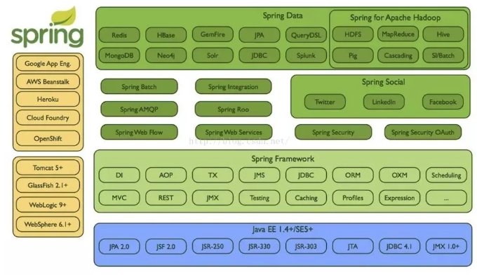

SpringBoot简介
====
## 一、SpringBoot设计目的
设计目的是用来简化新Spring应用的初始搭建以及开发过程。  
## 二、SpringBoot编程设计思想
SpringBoot:牺牲项目的自由度来减少配置发复杂度（“契约式编程”思想，SpringBoot自动配置方案的指导思想）。  
约定一套规则，把这些框架都自动配置集成好，从而达到“开箱即用”。同时，也支持自由配置。  

## 三、SpringBoot的特性：
+ 创建独立的Spring applications  
+ 能够使用内嵌的Tomcat、Jetty、Undertow,不需要部署war  
+ 提供定制化的starter poms来简化maven配置(gradle相同)  
+ 追求极致的自动配置Spring  
+ 提供一些生产环境的特性，比如特征指标，健康检查和外部配置。  
+ 零代码生成和零XML配置  
## 四、Spring生态介绍  
#### Spring生态顶级项目  
作为当前主流的企业框架Spring,它提供了一整套相关的顶级项目，能让开发者快速的上手实现自己的应用。  
  

**Spring IO platform:** 用于系统部署，是可集成的，构建现代化应用的版本平台，具体来说当你使用maven dependency引入Spring jar包时它就在工作了。  

**Spring Boot:** 旨在简化创建产品级的Spring应用和服务，简化了配置文件，使用嵌入式web服务器，含有诸多开箱即用微服务功能，可以和Spring Cloud联合部署。  

**Spring Framework:** 即通常所说的Spring框架，是一个开源的Java/Java EE全功能栈应用程序框架，其它Spring项目如Spring boot也依赖于此框架。  

**Spring Cloud:** 微服务工具包，为开发者提供了在分布式系统的配置管理、服务发现、断路器、智能路由、微代理、控制总线等开发工具包。  

**Spring XD:** 是一种运行时环境(服务器软件，非开发框架)，组合Spring技术，如Spring batch、Spring boot、Spring data,采集大数据并处理。  

**Spring Data:** 是一个数据访问及操作的工具包，封装了很多种数据及数据库的访问相关技术，包括：jdbc、Redis、MongoDB、Neo4j等。  

**Spring Batch:** 批处理框架，或说是批量任务执行管理器，功能包括任务调度、日志记录/跟踪等。  

**Spring Security:**  是一个能够为基于Spring的企业应用系统提供声明式的安全访问控制解决方案的安全框架。  

**Spring Integration:** 面向企业应用集成(EAI/ESB)的编程框架，支持的通信方式包括HTTP、FTP、TCP/UDP、JMS、RabbitMQ、Email等。  

**Spring Social:** 一组工具包，一组连接社交服务API,如Twitter、FaceBook、GitHub等  

**Spring AMQP:** 消息队列操作的工具包，主要是封装了RabbitMQ操作。  

**Spring HATEOAS:** 是一个用于支持实现超文本驱动的REST Web服务的开发库。  

**Spring Mobile：** 是Spring MVC的扩展，用来简化手机上的Web应用开发。  

**Spring for Android：** 是Spring框架的一个扩展，其主要目的在乎简化Android本地应用的开发，提供RestTemplate来访问Rest服务。  

**Spring Web Flow：** 目标是成为管理Web应用页面流程的最佳方案，将页面跳转流程单独管理，并可配置 。   

**Spring LDAP：** 是一个用于操作LDAP的Java工具包，基于Spring的JdbcTemplate模式，简化LDAP访问。  

**Spring Session：** session管理的开发工具包，让你可以把session保存到redis等，进行集群化session管理。  

**Spring Web Services：** 是基于Spring的Web服务框架，提供SOAP服务开发，允许通过多种方式创建Web服务。  

**Spring Shell：** 提供交互式的Shell可让你使用简单的基于Spring的编程模型来开发命令，比如Spring Roo命令。  

**Spring Roo：**  是一种Spring开发的辅助工具，使用命令行操作来生成自动化项目，操作非常类似于Rails。  

**Spring Scala：** 为Scala语言编程提供的spring框架的封装（新的编程语言，Java平台的Scala于2003年底/2004年初发布）。  

**Spring BlazeDS Integration：** 一个开发RIA工具包，可以集成Adobe Flex、BlazeDS、Spring以及Java技术创建RIA。  

**Spring Loaded：** 用于实现java程序和web应用的热部署的开源工具。  

**Spring REST Shell：** 可以调用Rest服务的命令行工具，敲命令行操作Rest服务。  

