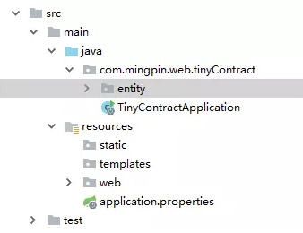

SpringBoot项目目录结构介绍
====
## 一、目录文件结构说明

+ **src/main/java:** 主程序入口TinyContractApplication,可以通过直接运行该类来启动SpringBoot应用  
+ **src/main/resources:** 配置目录，该目录用来存放应用的一些配置信息，比如应用名、服务端口、数据库配置等。  
    由于我们应用了WEB模块，因此产生了static目录与templates目录，前者用于存放静态资源，如图片、CSS、JavaScript等;后者用于存放WEB页面的模版文件。  
+ **src/test:** 单元测试目录，生成的TinyContractApplicationTests通过JUnit4实现，可以直接用运行Spring Boot应用的测试。  
**application.properties:** 用来保存数据库链接信息等应用程序数据

默认生成的SpringBoot项目;  
+ 主程序已经生成好了，我们只需要我们自己的逻辑  
+ resources文件夹中目录结构  
    + **static:** 保存所有的静态资源; js css images;
    + **templates:** 保存所有的模版页面;(Spring Boot默认jar包使用嵌入式的Tomcat,默认不支持JSP页面);可以使用模版引擎(freemarker、thymeleaf);  
    + **application.properties:** Spring Boot应用的配置文件;可以修改一些默认设置;  
    

