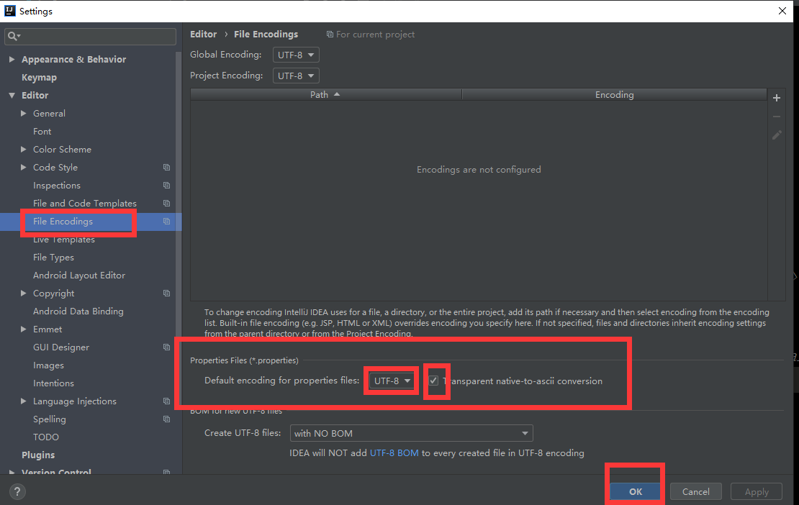

配置文件注入
====
#### 01.配置文件  
>
    person:
        lastName: hello
        age: 18
        boss: false
        birth: 2018/01/12
        maps: {k1: v1,k2: v2}
        lists:
            - lisi
            - zhaols
        dog: 
            name: 小狗
            age: 12
> 
#### JavaBean:  
>
    /*
    将配置文件中配置的每一个属性的值，映射到这个组件中  
    @ConfigurationProperties:告诉SpringBoot将本类中的所有属性和配置文件中相关的配置进行绑定;
        prefix="person":配置文件中哪个下面的所有属性进行一一映射
        
        只有这个组件是容器中的组件，才能有容器提供的@ConfigurationProperties功能;
    */
    @Component 
    @ConfigurationProperties(prefix = "person") 
    public class Person {       
    private String lastName;     
    private Integer age;     
    private Boolean boss;     
    private Date birth;       
    private Map<String,Object> maps;     
    private List<Object> lists;     
    private Dog dog;
>  
#### 02.导入配置文件处理器
>
    <!-- 导入配置文件处理器，配置文件中进行绑定就会有提示 -->
    <dependency>
        <groupId>org.springframework.boot</groupId>
        <artifactId>spring‐boot‐configuration‐processor</artifactId>
        <optional>true</optional>
    </dependency>
>
#### 03.properties配置文件在idea中默认utf-8可能会乱码
  
#### 04.@Value获取值和@ConfigurationProperties获取值比较  
（空格） | @ConfigurationProperties| @Value
---------| -------------| -------------
功能 | 批量注入配置文件中的属性| 一个个指定
松散绑定(松散语法) | 支持| 不支持
SpEL(数学运算)| 不支持| 支持
JSR303数据校验| 支持| 不支持
复杂类型封装| 支持| 不支持

#### 注：properties和@value注解使用条件
如果说，我们只是在某个业务逻辑中需要获取一下配置文件中的某项值，使用@Value;  
如果说，我们专门编写一个javaBean来和配置文件进行映射，我们就0直接使用@ConfigurationProperties;  
